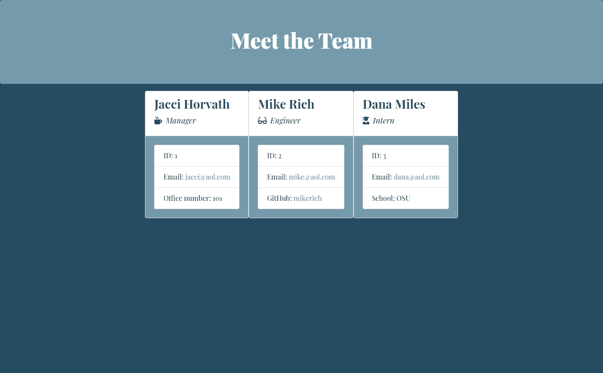
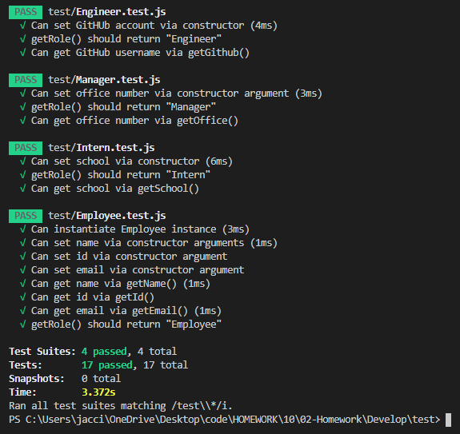

# Template Engine - Employee Summary

## Description
In this repository you will find a Node CLI that takes in information about employees and generates an HTML webpage that displays summaries for each person.

## Table of Contents
* [Installation](#installation)
* [Usage](#usage)
* [Tests](#tests)
* [Contributing](#contributing)
* [Questions](#questions)
* [License](#license)


## Installation
To begin using this application, the user must first open the terminal. Next, the user must install all dependencies by running the following command:

```bash
npm install
```


## Usage
This application will be invoked by running the following command:

```bash
node index.js
```

Once invoked, the user will be prompted with a series of questions. Input is required for all questions and may be submitted by pressing enter. The user's input will then be used to generate an HTML webpage that displays all team members, built using the input provided.



[Watch a video walkthrough of the application.](https://drive.google.com/file/d/1BXsH09yvkxwJH13UqWF_2jkCOLhUm6vi/view)


## Tests
To ensure this code is maintainable, all unit tests have passed. 




Users can run the tests by running the following command:

```bash
npm test
```


## Contributing
* [Node.js](https://nodejs.org/en/)
* [Inquirer](https://www.npmjs.com/package/inquirer)
* [npm](https://www.npmjs.com/)
* [Bootstrap](https://getbootstrap.com/)
* [Google Fonts](https://fonts.google.com/)


## Questions
Find [jaccihorvath on GitHub](https://github.com/jaccihorvath) or email [jacci@gmail.com](mailto:jacci@gmail.com) with additional questions.


## License
Copyright (c) [jaccihorvath](https://github.com/jaccihorvath).
Licensed under the MIT License.